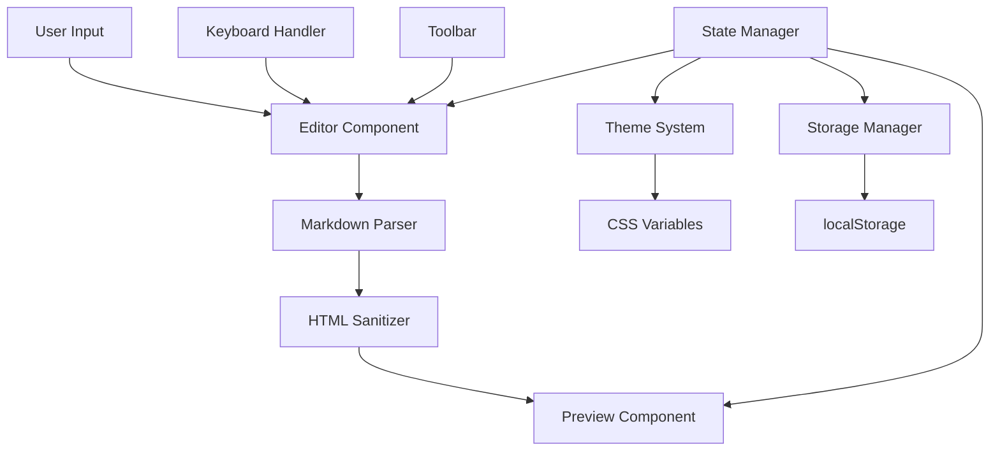

# Design Document

## Overview

Markdown Editor - это современное веб-приложение для редактирования Markdown с живым предпросмотром, построенное на принципах минимализма, доступности и безопасности. Приложение использует чистый HTML/CSS/JavaScript без внешних зависимостей и обеспечивает отличный пользовательский опыт на всех устройствах от мобильных до десктопных.

Архитектура основана на модульном подходе с четким разделением ответственности между компонентами парсинга, UI и управления состоянием.

## Architecture

### High-Level Architecture



### Component Architecture

Приложение состоит из следующих основных компонентов:

1. **App Controller** - главный контроллер приложения
2. **Markdown Parser** - парсер Markdown в HTML
3. **HTML Sanitizer** - санитизация HTML для безопасности
4. **UI Manager** - управление пользовательским интерфейсом
5. **Theme System** - система тем (светлая/темная)
6. **Storage Manager** - управление localStorage
7. **Keyboard Handler** - обработка горячих клавиш

## Components and Interfaces

### 1. App Controller

```javascript
class MarkdownEditor {
  constructor()
  init()
  setState(newState)
  getState()
  render()
}
```

**Ответственность:**
- Инициализация приложения
- Управление глобальным состоянием
- Координация между компонентами

### 2. Markdown Parser

```javascript
class MarkdownParser {
  parse(markdown)
  parseHeaders(text)
  parseInlineFormatting(text)
  parseLists(text)
  parseCodeBlocks(text)
  parseLinks(text)
  parseBlockquotes(text)
}
```

**Поддерживаемые элементы:**
- Заголовки: `# ## ###` → `<h1> <h2> <h3>`
- Жирный текст: `**text**` → `<strong>text</strong>`
- Курсив: `*text*` → `<em>text</em>`
- Зачеркнутый: `~~text~~` → `<del>text</del>`
- Inline код: `` `code` `` → `<code>code</code>`
- Блоки кода: ``` → `<pre><code>content</code></pre>`
- Списки: `- item` → `<ul><li>item</li></ul>`
- Нумерованные списки: `1. item` → `<ol><li>item</li></ol>`
- Цитаты: `> text` → `<blockquote>text</blockquote>`
- Ссылки: `[text](url)` → `<a href="url">text</a>`
- Горизонтальные линии: `---` → `<hr>`

### 3. HTML Sanitizer

```javascript
class HTMLSanitizer {
  sanitize(html)
  isAllowedTag(tagName)
  isAllowedAttribute(tagName, attrName, attrValue)
  escapeHTML(text)
}
```

**Безопасность:**
- Whitelist разрешенных HTML тегов
- Фильтрация опасных атрибутов (onclick, onerror, etc.)
- Валидация URL (только http/https)
- Экранирование специальных символов

**Разрешенные теги:** `h1, h2, h3, p, strong, em, del, code, pre, ul, ol, li, blockquote, a, hr`

### 4. UI Manager

```javascript
class UIManager {
  initializeLayout()
  setupEventListeners()
  updatePreview(html)
  showToast(message, type)
  updateCounters(text)
  toggleViewMode(mode)
}
```

**Режимы отображения:**
- **Split** (по умолчанию на десктопе): редактор и превью рядом
- **Editor Only**: только редактор
- **Preview Only**: только превью
- **Tabs** (на мобильных): переключение между редактором и превью

### 5. Theme System

```javascript
class ThemeManager {
  init()
  setTheme(theme)
  toggleTheme()
  detectSystemPreference()
  saveThemePreference(theme)
}
```

**Темы:**
- **Light Theme**: светлая тема с высоким контрастом
- **Dark Theme**: темная тема для работы в условиях низкой освещенности
- **Auto**: следует системным настройкам `prefers-color-scheme`

### 6. Storage Manager

```javascript
class StorageManager {
  saveContent(content)
  loadContent()
  saveSettings(settings)
  loadSettings()
  clearStorage()
}
```

**Сохраняемые данные:**
- Содержимое редактора (с debounce 400ms)
- Настройки темы
- Режим отображения
- Размеры панелей

### 7. Keyboard Handler

```javascript
class KeyboardHandler {
  init()
  handleShortcut(event)
  insertFormatting(type, selectedText)
}
```

**Горячие клавиши:**
- `Ctrl/Cmd + B`: жирный текст
- `Ctrl/Cmd + I`: курсив
- `Ctrl/Cmd + K`: вставка ссылки
- `Ctrl/Cmd + S`: сохранение
- `Escape`: закрытие модальных окон

## Data Models

### Application State

```javascript
const appState = {
  content: '',           // Содержимое редактора
  theme: 'auto',         // Текущая тема
  viewMode: 'split',     // Режим отображения
  isLoading: false,      // Состояние загрузки
  lastSaved: null,       // Время последнего сохранения
  counters: {
    characters: 0,
    words: 0,
    lines: 0
  }
}
```

### Parser Configuration

```javascript
const parserConfig = {
  allowedTags: ['h1', 'h2', 'h3', 'p', 'strong', 'em', 'del', 'code', 'pre', 'ul', 'ol', 'li', 'blockquote', 'a', 'hr'],
  allowedAttributes: {
    'a': ['href'],
    '*': ['class']
  },
  allowedProtocols: ['http:', 'https:']
}
```

## Correctness Properties

*A property is a characteristic or behavior that should hold true across all valid executions of a system-essentially, a formal statement about what the system should do. Properties serve as the bridge between human-readable specifications and machine-verifiable correctness guarantees.*

### Property 1: Markdown Parsing Round-trip Consistency
*For any* valid Markdown text, parsing it to HTML and then extracting the semantic content should preserve the original meaning and structure.
**Validates: Requirements 2.1, 2.2, 2.3, 2.4, 2.5, 2.6, 2.7, 2.8, 2.9, 2.11, 2.12**

### Property 2: Real-time Preview Updates
*For any* text input in the editor, the preview panel should update immediately to reflect the current content.
**Validates: Requirements 1.1**

### Property 3: HTML Sanitization Security
*For any* potentially malicious input containing script tags, event handlers, or dangerous attributes, the sanitized output should contain no executable code.
**Validates: Requirements 8.1, 8.2, 8.4**

### Property 4: URL Validation Safety
*For any* link in Markdown format, only URLs with http or https protocols should be rendered as clickable links.
**Validates: Requirements 2.10, 8.3**

### Property 5: Toolbar Formatting Insertion
*For any* text selection and formatting type, clicking a toolbar button should insert the correct Markdown syntax around the selection or at the cursor position.
**Validates: Requirements 3.4**

### Property 6: Content Counter Accuracy
*For any* text content, the character, word, and line counters should accurately reflect the actual count in the editor.
**Validates: Requirements 3.5**

### Property 7: Auto-save Debouncing
*For any* sequence of rapid text changes, content should be saved to localStorage only after the debounce period (300-500ms) has elapsed without further changes.
**Validates: Requirements 6.1**

### Property 8: Responsive Layout Adaptation
*For any* viewport width between 320px and 1200px+, the layout should adapt appropriately without horizontal scrolling or broken elements.
**Validates: Requirements 4.1**

## Error Handling

### Parser Error Recovery
- **Malformed Markdown**: При обнаружении некорректного синтаксиса парсер должен продолжить работу, отображая проблемный участок как обычный текст
- **Unclosed Elements**: Незакрытые элементы (например, незакрытые блоки кода) должны автоматически закрываться в конце документа
- **Invalid URLs**: Некорректные URL в ссылках должны отображаться как обычный текст без создания ссылки

### Storage Error Handling
- **Quota Exceeded**: При превышении лимита localStorage показывать предупреждение и предлагать очистку старых данных
- **Storage Unavailable**: При недоступности localStorage работать в режиме "только сессия" без сохранения

### Network and Performance
- **Large Content**: Для больших документов (>100KB) использовать виртуализацию или пагинацию
- **Memory Management**: Очистка неиспользуемых DOM элементов и event listeners

## Testing Strategy

### Dual Testing Approach

Приложение будет тестироваться с использованием двух дополняющих друг друга подходов:

**Unit Tests:**
- Тестирование конкретных примеров и граничных случаев
- Проверка интеграционных точек между компонентами
- Тестирование обработки ошибок и исключительных ситуаций
- Проверка доступности и пользовательского интерфейса

**Property-Based Tests:**
- Проверка универсальных свойств на множестве сгенерированных входных данных
- Тестирование безопасности с различными потенциально опасными входными данными
- Проверка корректности парсинга на широком спектре Markdown контента
- Валидация производительности и стабильности

### Property-Based Testing Configuration

Для property-based тестирования будет использоваться библиотека **fast-check** для JavaScript:

- **Минимум 100 итераций** на каждый property test для обеспечения надежности
- **Теги для каждого теста**: `Feature: markdown-editor, Property {number}: {property_text}`
- **Генераторы данных**: Специализированные генераторы для Markdown контента, HTML, URL и пользовательского ввода
- **Shrinking**: Автоматическое упрощение failing cases для лучшей диагностики

### Test Organization

```
tests/
├── unit/
│   ├── parser.test.js
│   ├── sanitizer.test.js
│   ├── ui.test.js
│   └── storage.test.js
├── property/
│   ├── parsing.property.test.js
│   ├── security.property.test.js
│   └── ui.property.test.js
└── integration/
    └── app.integration.test.js
```

### Coverage Requirements

- **Unit Test Coverage**: Минимум 90% покрытие кода
- **Property Test Coverage**: 100% покрытие критических свойств безопасности и корректности
- **Integration Coverage**: Полное покрытие пользовательских сценариев

## Implementation Notes

### File Structure
```
markdown-editor/
├── index.html          # Главная страница
├── styles.css          # Все стили
├── app.js             # Весь JavaScript код
└── REPORT.md          # Отчет о проекте
```

### CSS Architecture
- **CSS Custom Properties** для тем и переменных
- **CSS Grid** для основной структуры layout
- **Flexbox** для компонентов и выравнивания
- **Mobile-first** responsive design
- **Focus-visible** для accessibility

### JavaScript Architecture
- **ES6+ синтаксис** с поддержкой современных браузеров
- **Модульная структура** с четким разделением ответственности
- **Event-driven** архитектура для UI взаимодействий
- **Debounced** операции для производительности

### Security Considerations
- **Content Security Policy** headers для дополнительной защиты
- **Input validation** на всех уровнях
- **Output encoding** для предотвращения XSS
- **Safe defaults** для всех конфигураций

### Performance Optimizations
- **Debounced** auto-save и live preview
- **Efficient DOM** updates с минимальными reflows
- **Lazy loading** для больших документов
- **Memory management** для long-running sessions